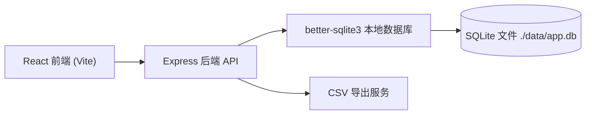
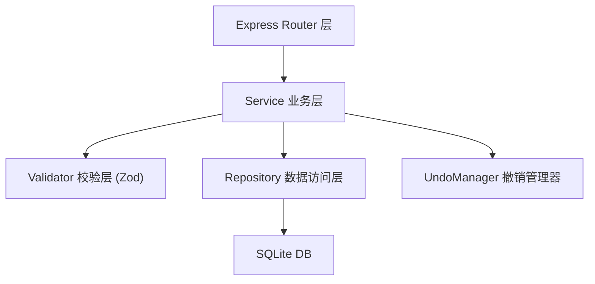

## 1. 架构设计



前后端分离架构，本地单节点部署，所有数据持久化在本地 SQLite 文件，重启后数据不丢失。

## 2. 技术描述
- 前端：React@18 + TypeScript + Vite + Tailwind CSS@3 + Zustand + lucide-react
- 初始化工具：vite-init（react-express-ts 模板）
- 后端：Express@4 + TypeScript + better-sqlite3
- 数据库：SQLite（本地文件存储，无需额外服务）
- 数据校验：Zod
- 状态管理：Zustand（前端）
- HTTP 客户端：fetch API（原生）

## 3. 路由定义

| 前端路由 | 页面用途 |
|----------|----------|
| / | 工作台（工单看板首页） |
| /tickets/:id | 工单详情页 |
| /tickets/new | 新建工单页 |
| /technicians | 技师管理页 |
| /export | 导出中心页 |
| /audit | 审计日志页 |

| 后端 API 路由 | 方法 | 用途 |
|---------------|------|------|
| /api/tickets | GET | 获取工单列表（支持状态筛选） |
| /api/tickets/:id | GET | 获取工单详情（含派单、备注、审计日志） |
| /api/tickets | POST | 创建工单 |
| /api/tickets/:id/assign | POST | 派单（分配技师） |
| /api/tickets/:id/status | PATCH | 推进工单状态 |
| /api/tickets/:id/undo | POST | 撤销最近一次操作 |
| /api/tickets/:id/notes | POST | 追加备注 |
| /api/technicians | GET | 获取技师列表 |
| /api/technicians | POST | 新增技师 |
| /api/technicians/:id | PATCH | 修改技师 |
| /api/technicians/:id | DELETE | 删除技师 |
| /api/technicians/:id/vacations | POST | 新增休假 |
| /api/technicians/available | POST | 查询指定时间/技能下可用技师 |
| /api/export/csv | GET | 导出 CSV（支持日期、技师筛选） |
| /api/audit | GET | 获取全局审计日志 |

## 4. API 定义

### 核心类型定义
```typescript
// 工单状态
type TicketStatus = 'new' | 'pending_assign' | 'in_progress' | 'pending_verify' | 'closed';

// 紧急程度
type Urgency = 'low' | 'medium' | 'high' | 'critical';

// 技能标签
type Skill = 'air_conditioner' | 'refrigerator' | 'washing_machine' | 'computer' | 'network' | 'plumbing' | 'electrical' | 'elevator';

// 技师
interface Technician {
  id: number;
  name: string;
  employeeId: string;
  skills: Skill[];
  dailyLimit: number;
  createdAt: string;
}

// 休假
interface Vacation {
  id: number;
  technicianId: number;
  startDate: string;
  endDate: string;
  reason?: string;
}

// 工单
interface Ticket {
  id: number;
  ticketNo: string;
  title: string;
  location: string;
  description: string;
  contactName: string;
  contactPhone: string;
  urgency: Urgency;
  expectedDate: string;
  status: TicketStatus;
  technicianId?: number;
  assignedAt?: string;
  createdAt: string;
  updatedAt: string;
}

// 备注
interface Note {
  id: number;
  ticketId: number;
  operator: string;
  content: string;
  createdAt: string;
}

// 审计日志
interface AuditLog {
  id: number;
  ticketId?: number;
  operator: string;
  action: 'create' | 'assign' | 'status_change' | 'undo' | 'note_add' | 'technician_create' | 'technician_update';
  beforeData?: string;
  afterData?: string;
  description: string;
  createdAt: string;
  undoOfId?: number; // 若为撤销操作，指向被撤销的日志 ID
}

// 操作快照（用于撤销）
interface OperationSnapshot {
  ticketId: number;
  auditLogId: number;
  previousStatus: TicketStatus;
  previousTechnicianId?: number;
}
```

## 5. 服务端架构



- Router：解析 HTTP 请求，参数提取，返回统一 JSON 格式
- Service：核心业务逻辑（状态流转校验、派单校验、撤销逻辑）
- Validator：输入校验（必填、格式、枚举值）
- Repository：SQL 封装，纯数据读写
- UndoManager：维护每个工单最近一次可撤销操作的快照

## 6. 数据模型

### 6.1 ER 图

```mermaid
erDiagram
    TECHNICIAN ||--o{ VACATION : has
    TECHNICIAN ||--o{ TICKET : "assigned to"
    TICKET ||--o{ NOTE : has
    TICKET ||--o{ AUDIT_LOG : has
    TICKET ||--o| OPERATION_SNAPSHOT : has

    TECHNICIAN {
        INTEGER id PK
        TEXT name
        TEXT employee_id
        TEXT skills
        INTEGER daily_limit
        TEXT created_at
    }
    VACATION {
        INTEGER id PK
        INTEGER technician_id FK
        TEXT start_date
        TEXT end_date
        TEXT reason
    }
    TICKET {
        INTEGER id PK
        TEXT ticket_no
        TEXT title
        TEXT location
        TEXT description
        TEXT contact_name
        TEXT contact_phone
        TEXT urgency
        TEXT expected_date
        TEXT status
        INTEGER technician_id FK
        TEXT assigned_at
        TEXT created_at
        TEXT updated_at
    }
    NOTE {
        INTEGER id PK
        INTEGER ticket_id FK
        TEXT operator
        TEXT content
        TEXT created_at
    }
    AUDIT_LOG {
        INTEGER id PK
        INTEGER ticket_id FK
        TEXT operator
        TEXT action
        TEXT before_data
        TEXT after_data
        TEXT description
        TEXT created_at
        INTEGER undo_of_id
    }
    OPERATION_SNAPSHOT {
        INTEGER id PK
        INTEGER ticket_id UNIQUE FK
        INTEGER audit_log_id
        TEXT previous_status
        INTEGER previous_technician_id
    }
```

### 6.2 DDL 与初始数据

```sql
-- 技师表
CREATE TABLE IF NOT EXISTS technicians (
  id INTEGER PRIMARY KEY AUTOINCREMENT,
  name TEXT NOT NULL,
  employee_id TEXT UNIQUE NOT NULL,
  skills TEXT NOT NULL, -- JSON 数组
  daily_limit INTEGER NOT NULL DEFAULT 3,
  created_at TEXT NOT NULL
);

-- 休假表
CREATE TABLE IF NOT EXISTS vacations (
  id INTEGER PRIMARY KEY AUTOINCREMENT,
  technician_id INTEGER NOT NULL REFERENCES technicians(id),
  start_date TEXT NOT NULL,
  end_date TEXT NOT NULL,
  reason TEXT,
  created_at TEXT NOT NULL
);

-- 工单表
CREATE TABLE IF NOT EXISTS tickets (
  id INTEGER PRIMARY KEY AUTOINCREMENT,
  ticket_no TEXT UNIQUE NOT NULL,
  title TEXT NOT NULL,
  location TEXT NOT NULL,
  description TEXT NOT NULL,
  contact_name TEXT NOT NULL,
  contact_phone TEXT NOT NULL,
  urgency TEXT NOT NULL,
  expected_date TEXT NOT NULL,
  status TEXT NOT NULL DEFAULT 'pending_assign',
  technician_id INTEGER REFERENCES technicians(id),
  assigned_at TEXT,
  created_at TEXT NOT NULL,
  updated_at TEXT NOT NULL
);

-- 备注表
CREATE TABLE IF NOT EXISTS notes (
  id INTEGER PRIMARY KEY AUTOINCREMENT,
  ticket_id INTEGER NOT NULL REFERENCES tickets(id),
  operator TEXT NOT NULL,
  content TEXT NOT NULL,
  created_at TEXT NOT NULL
);

-- 审计日志表
CREATE TABLE IF NOT EXISTS audit_logs (
  id INTEGER PRIMARY KEY AUTOINCREMENT,
  ticket_id INTEGER REFERENCES tickets(id),
  operator TEXT NOT NULL,
  action TEXT NOT NULL,
  before_data TEXT,
  after_data TEXT,
  description TEXT NOT NULL,
  created_at TEXT NOT NULL,
  undo_of_id INTEGER REFERENCES audit_logs(id)
);

-- 撤销快照表（每个工单只保留最近一次可撤销操作）
CREATE TABLE IF NOT EXISTS operation_snapshots (
  id INTEGER PRIMARY KEY AUTOINCREMENT,
  ticket_id INTEGER UNIQUE NOT NULL REFERENCES tickets(id),
  audit_log_id INTEGER NOT NULL REFERENCES audit_logs(id),
  previous_status TEXT NOT NULL,
  previous_technician_id INTEGER REFERENCES technicians(id)
);

-- 索引
CREATE INDEX IF NOT EXISTS idx_tickets_status ON tickets(status);
CREATE INDEX IF NOT EXISTS idx_tickets_technician ON tickets(technician_id);
CREATE INDEX IF NOT EXISTS idx_audit_ticket ON audit_logs(ticket_id);
CREATE INDEX IF NOT EXISTS idx_notes_ticket ON notes(ticket_id);

-- 初始样例数据：3 名技师
INSERT INTO technicians (name, employee_id, skills, daily_limit, created_at) VALUES
  ('张伟', 'T001', '["air_conditioner","refrigerator","electrical"]', 3, datetime('now')),
  ('李娜', 'T002', '["computer","network","electrical"]', 4, datetime('now')),
  ('王强', 'T003', '["plumbing","elevator","washing_machine"]', 2, datetime('now'));

-- 初始样例数据：1 条休假（张伟明天休假）
INSERT INTO vacations (technician_id, start_date, end_date, reason, created_at) VALUES
  (1, date('now', '+1 day'), date('now', '+1 day'), '年假', datetime('now'));

-- 初始样例数据：2 张工单
INSERT INTO tickets (ticket_no, title, location, description, contact_name, contact_phone, urgency, expected_date, status, created_at, updated_at) VALUES
  ('WO-2026-0001', '3楼空调不制冷', '研发中心3楼301', '空调开机后不出冷风，已使用5年', '陈主管', '13800000001', 'high', date('now', '+2 days'), 'pending_assign', datetime('now'), datetime('now')),
  ('WO-2026-0002', '会议室投影仪无法开机', '行政楼2楼大会议室', '按电源键无反应，指示灯不亮', '刘助理', '13800000002', 'medium', date('now', '+1 day'), 'pending_assign', datetime('now'), datetime('now'));
```
